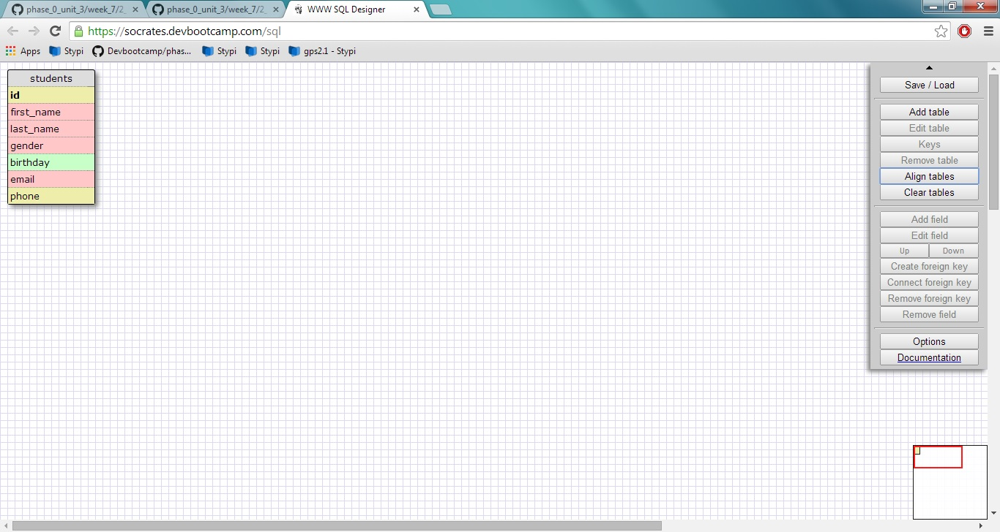
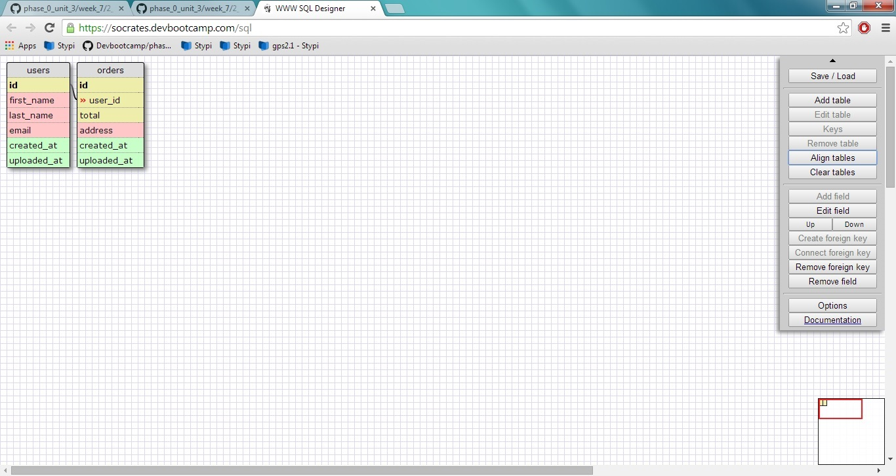
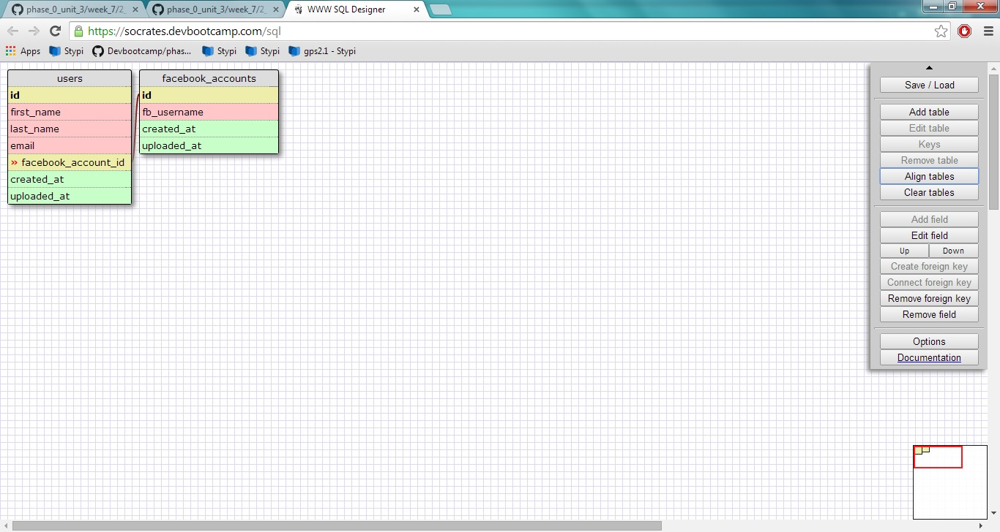
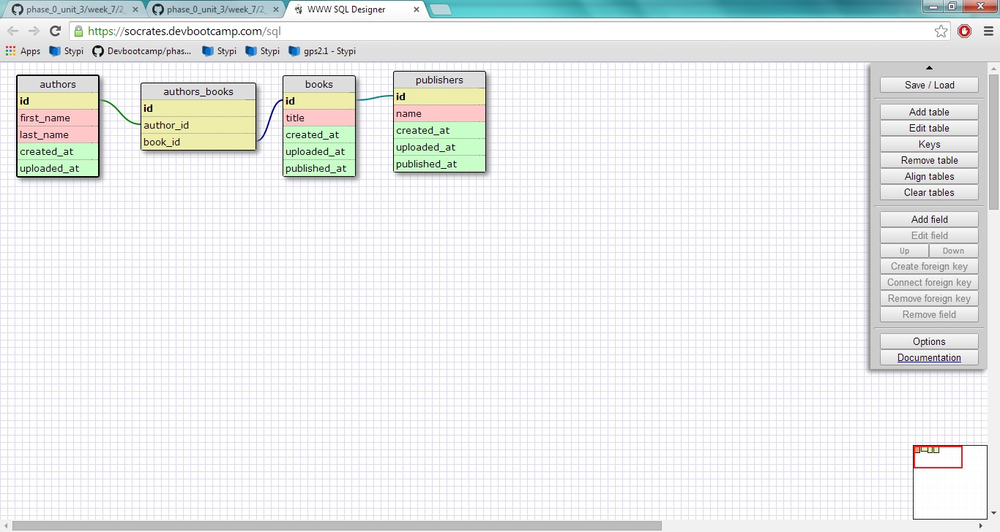
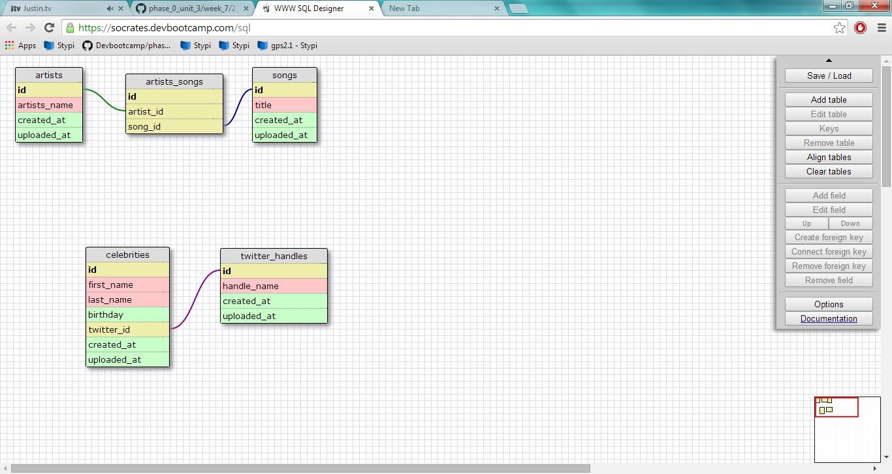

# U3.W7: Designing Schemas

#### I worked on this challenge by myself.

## Release 0: Student Roster Schema

## Release 1: One to Many Schema

## Release 2: One to One Schema

## Release 3: Many to Many Schema

## Release 4: Design your own Schema
Description of what you're modeling: 
I'm modeling a database that keeps track of artists
and songs they play. This is a many to many relationship.

I'm also modeling a database that keeps track of
celebrities and their twitter handles. This is a one to
one relationship.

## Release 5: Reflection
I've worked with schemas before, but this is the first
time I've modeled them this way. I was pretty confused
for a lot of this assignment, and I'm not exactly sure
what the practicality of these schema represent, but I
am confident that all of this will be revealed as I
continue to learn SQL.