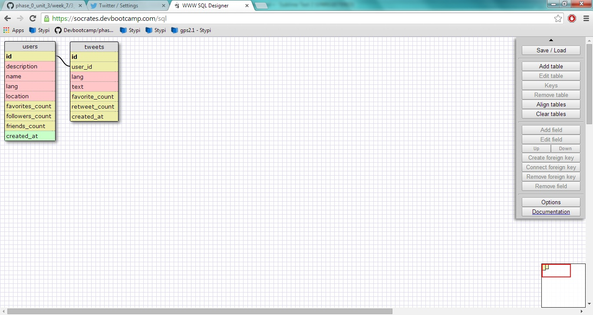

# U3.W7: Modeling a Real-World Database (SOLO CHALLENGE)

## Release 0: Users Fields
created_at
description
favorites_count
followers_count
friends_count
id
lang
location
name

## Release 1: Tweet Fields
created_at
favorite_count
id
lang
retweet_count
text
user_id

## Release 2: Explain the relationship
The relationship between `users` and `tweets` is: 
a one to many relationship. Each 'user' can have many
tweets, but each tweet can only have one user associated
with it.

## Release 3: Schema Design

## Release 4: SQL Statements
all the tweets for a certain user id
	SELECT text
	FROM tweets
	WHERE user_id = "XXXXXXX" (X's represent numbers)

the tweets for a certain user id that were made after last Wednesday
	SELECT text
	FROM tweets
	WHERE user_id = "XXXXXXX" (X's represent numbers)
	AND created_at > '04-30-2014'

all the tweets associated with a given user's twitter handle
	SELECT text
	FROM users
	JOIN tweets
	ON users.id = tweets.user_id
	WHERE name = 'timcclung'

the twitter handle associated with a given tweet id
	SELECT name
	FROM users
	JOIN tweets
	ON users.id = tweets.user_id
	WHERE tweet.id = 'XXXXXXX' (X's represent numbers)

## Release 5: Reflection
I'm not sure if my fields are correct: I looked on twitter for a bit
and found a dev section where they display all the fields that are present.
Some of them I felt were unrelated to this assignment so I left them out, but
there were many more. I feel pretty confident about my SQL statements.